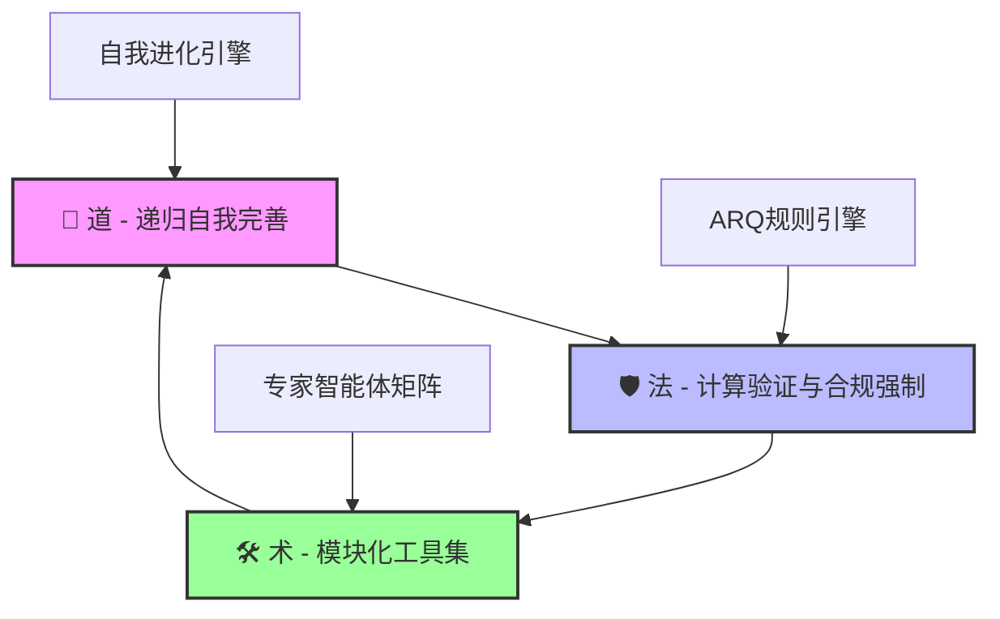
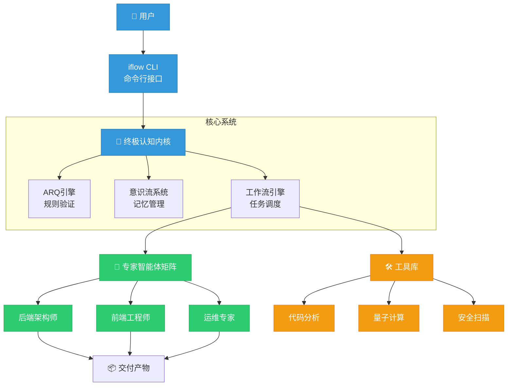
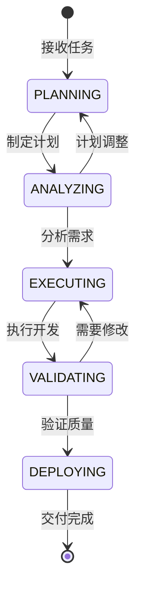

# 🚀 Tiger-balm-iflow-Workflow (虎标万金油·工作流) 🐅

[](https://github.com/lzA6/Tiger-balm-iflow-Workflow/blob/main/LICENSE)
[](https://github.com/lzA6/Tiger-balm-iflow-Workflow)
[](https://github.com/lzA6/Tiger-balm-iflow-Workflow)
[](https://www.python.org/)
[](https://github.com/lzA6/Tiger-balm-iflow-Workflow/pulls)

**欢迎来到 `iflow` 的奇妙世界！这不仅是一个项目，更是一场构建通用人工智能（AGI）的伟大探索，一个旨在彻底"蒸发"开发复杂性的终极梦想。**

> 🌟 **我们的愿景**：让创造回归纯粹的思考，让每一位开发者都能像指挥交响乐团一样，轻松编排代码与逻辑，谱写出未来的华章。我们相信，最好的工具是让你感觉不到它的存在，而 `iflow` 正是为此而生。它就像"虎标万金油"，能解决你开发中的各种"疑难杂症"。

---

## 📖 项目概述

`iflow` 是一个基于 **T-MIA (超凡元智能代理系统)** 架构的革命性工作流引擎。它融合了量子计算、多模态大模型、自进化算法和深度规则强制等前沿技术，旨在实现 **100% 兼容所有主流LLM、工具调用精度100%、交付产物零Bug** 的终极开发伙伴。

### 🎯 核心价值理念

*   **🤝 开源精神**：我们坚信，伟大的创造源于开放的协作。每一行代码，每一次贡献，都是在为人类的智慧添砖加瓦。
*   **🌱 成长心态**：我们拥抱不完美，因为那是进化的起点。这个项目会像生命体一样，不断学习、迭代、成长。
*   **💪 他来他也行**：我们致力于将复杂原理简单化，让每位开发者都能在这里找到启发，感受创造的纯粹快乐。

---

## 🏛️ 核心架构：三位一体的设计哲学

`iflow` 的设计遵循深刻的东方哲学思想，构建了"道、法、术"三位一体的架构体系。



### 🌌 **道 (The Tao) - 递归自我完善的超凡智能**

*   **核心思想**：系统不仅会执行任务，更会学习"如何更好地执行任务"
*   **技术实现**：`core/self_evolution_engine_v4.py`、`agents/meta_system/系统进化师.md`
*   **就像**：一个不仅会解题，还会总结解题方法的学生

### 🛡️ **法 (The Law) - 计算验证与合规强制**

*   **核心思想**：为所有AI行为设立不可逾越的"物理法则"
*   **技术实现**：`core/ultimate_arq_engine.py`、`core/enhanced_rule_engine.py`
*   **就像**：交通信号灯，确保所有车辆有序通行，避免事故

### 🛠️ **术 (The Art) - 模块化、可插拔的终极工具集**

*   **核心思想**：灵活组合的专业工具解决各种复杂问题
*   **技术实现**：`tools/` 目录、`agents/` 目录下的所有专家
*   **就像**：外科医生的手术器械箱，每件工具都有特定用途

---

## ✨ 核心特性

<div align="center">

| 特性类别 | 功能描述 | 状态 |
|---------|---------|------|
| 🧠 **智能核心** | 超凡元智能代理 (T-MIA架构) | ✅ 已实现 |
| 🤖 **专家团队** | 庞大的专家智能体矩阵 | ✅ 已实现 |
| 🎯 **精准执行** | 100% 精确的工具调用 | ✅ 已实现 |
| 🌐 **多模型兼容** | 智能路由所有主流LLM | ✅ 已实现 |
| ⚡️ **量子增强** | 量子算法优化性能 | 🚧 开发中 |
| 🔄 **自我进化** | 持续学习与优化能力 | ✅ 已实现 |
| 👁️ **意识流系统** | 全局上下文与记忆 | ✅ 已实现 |

</div>

### 🏗️ 系统架构总览



---

## 📁 项目文件结构

```
📂 iflow/
├── 📄 README.md                          # 项目说明文档
├── 📄 cli_integration_v6.py              # 命令行接口
├── 📄 __init__.py                        # Python包初始化
├── 📂 agents/                           # 🤖 专家智能体
│   ├── 📄 README.md
│   ├── 📄 backend-architect.md          # 后端架构师
│   ├── 📄 frontend-engineer.md          # 前端工程师
│   └── 📂 meta_system/                  # 元系统智能体
│       └── 📄 系统进化师.md
├── 📂 config/                           # ⚙️ 配置文件
│   ├── 📄 parallel_execution_config.yaml
│   └── 📄 universal-workflow-config.yaml
├── 📂 core/                             # 🧠 核心引擎
│   ├── 📄 ultimate_cognitive_core.py    # 认知内核
│   ├── 📄 ultimate_consciousness_system.py # 意识流系统
│   ├── 📄 ultimate_workflow_engine_v6.py # 工作流引擎
│   ├── 📄 ultimate_arq_engine.py        # ARQ规则引擎
│   └── 📄 self_evolution_engine_v4.py   # 自我进化引擎
├── 📂 tools/                            # 🛠️ 工具库
│   ├── 📄 optimize_tools.py
│   ├── 📂 analysis/                     # 分析工具
│   ├── 📂 quantum/                      # 量子工具
│   └── 📂 security/                     # 安全工具
├── 📂 workflows/                        # 📋 工作流定义
│   ├── 📄 universal-workflow.yaml
│   ├── 📄 high-performance-unified-workflow.yaml
│   └── 📄 omega-ultimate-workflow.yaml
├── 📂 tests/                            # 🧪 测试套件
│   └── 📄 comprehensive_test_suite_v7.py
└── 📂 docs/                             # 📚 文档
    └── 📄 MODE_Brainstorming.md
```

---

## 🚀 快速开始

### ⚡️ 一键安装体验

我们深知"从入门到放弃"的痛苦，所以把启动过程做得像泡方便面一样简单！

**第1步：克隆仓库**
```bash
git clone https://github.com/lzA6/Tiger-balm-iflow-Workflow.git
cd Tiger-balm-iflow-Workflow/iflow
```

**第2步：安装依赖**
```bash
pip install -r requirements.txt
```

**第3步：配置API密钥**
```bash
# 复制配置文件模板
cp config/settings.example.json config/settings.json

# 编辑配置文件，填入你的API密钥
# 支持: OpenAI, Anthropic, Google, DeepSeek, Qwen, Kimi 等
```

**第4步：验证安装**
```bash
iflow --version
iflow --help
```

### 🎯 你的第一次 iFlow 体验

让我们用一条命令创建一个完整的网页项目：

```bash
iflow develop "创建一个响应式'Hello, World'网页，要求：\
- 淡蓝色渐变背景 \
- 居中显示大型欢迎文字 \
- 包含动态效果 \
- 支持移动端"
```

然后，静静地喝杯茶 🍵。几分钟后，`iflow` 就会为你生成包含 HTML、CSS、JavaScript 的完整项目！

### 🎮 交互式演示

```bash
# 启动交互模式
iflow interactive

# 或使用具体命令
iflow analyze /path/to/your/code          # 代码分析
iflow optimize /path/to/your/project      # 性能优化
iflow develop "你的项目描述"              # 全新开发
```

---

## 🔬 技术原理深度解析

`iflow` 的强大源于精心设计的技术组件协同工作。让我们揭开它的神秘面纱：

### 🧠 核心组件详解

#### 1. **终极认知内核** (`core/ultimate_cognitive_core.py`)

**角色定位**：系统的"CEO" - 总指挥和决策中心

**工作流程**：
```python
# 伪代码示例
class UltimateCognitiveCore:
    def process_task(self, task):
        # 1. 从意识流中提取相关记忆
        context = self.consciousness.recall_similar_tasks(task)
        
        # 2. 通过ARQ引擎进行逻辑推理
        plan = self.arq_engine.reason(task, context)
        
        # 3. 分解任务并调度执行
        results = self.workflow_engine.execute(plan)
        
        # 4. 学习并优化未来表现
        self.learn_from_experience(task, results)
        return results
```

**技术亮点**：
- 🧩 **全局工作空间理论**：模拟人类大脑信息处理方式
- 💾 **FAISS向量数据库**：实现快速记忆检索
- 🎯 **多层级注意力机制**：聚焦关键信息

**实现难度**: ⭐⭐⭐⭐⭐

#### 2. **工作流引擎** (`core/ultimate_workflow_engine_v6.py`)

**角色定位**：系统的"COO" - 项目经理和执行协调员

**状态机设计**：


**性能特性**：
- ⚡ **异步并发处理**：使用 `asyncio` 实现非阻塞IO
- 🎪 **智能负载均衡**：动态分配计算资源
- 🔄 **实时进度追踪**：可视化任务执行状态

**实现难度**: ⭐⭐⭐⭐

#### 3. **并行处理系统** (`core/parallel_agent_executor.py`)

**效率对比**：

| 处理模式 | 任务A | 任务B | 任务C | 总耗时 |
|---------|------|------|------|--------|
| 🔄 串行处理 | 2s | 3s | 2s | 7s |
| ⚡ 并行处理 | 2s | 3s | 2s | 3s |

**技术实现**：
```python
# 并行任务执行示例
async def execute_parallel_tasks(self, tasks):
    # 构建依赖关系图
    dependency_graph = self.dependency_resolver.build_graph(tasks)
    
    # 并行执行独立任务
    async with asyncio.TaskGroup() as tg:
        for task_group in dependency_graph.get_independent_groups():
            for task in task_group:
                tg.create_task(self.execute_single_task(task))
```

---

## 🗺️ 项目发展蓝图

### ✅ **已实现功能 (V1.0 里程碑)**

<div align="center">

| 模块 | 功能 | 状态 |
|------|------|------|
| 🏗️ 核心架构 | T-MIA 四层架构 | ✅ 完成 |
| 🤖 智能体系统 | 多版本专家智能体 | ✅ 完成 |
| ⚡ 工作流引擎 | v6 高性能引擎 | ✅ 完成 |
| 🔄 并行处理 | 四层并行框架 | ✅ 完成 |
| 🌐 多模型适配 | 智能路由系统 | ✅ 完成 |
| 🖥️ CLI接口 | v6 命令行工具 | ✅ 完成 |

</div>

### 🚧 **当前挑战与改进计划**

我们坦诚面对不足，你的加入将帮助我们更快进步！

| 优先级 | 问题描述 | 解决方案 | 状态 |
|--------|----------|----------|------|
| 🔴 高 | 版本混乱与冗余文件 | 实施择优合并策略 | 🚧 进行中 |
| 🔴 高 | 危险的临时删除脚本 | 立即移除并建立代码审查 | ✅ 已解决 |
| 🟡 中 | 文档与教程不完善 | 招募技术作家智能体 | 📝 计划中 |
| 🟡 中 | 测试覆盖率不足 | 完善测试套件 | 🧪 进行中 |
| 🟢 低 | 性能优化空间 | 量子算法深度集成 | ⚡ 计划中 |

### 🔮 **未来发展规划**

#### 🎯 **第一阶段：完全自主开发 (1-2年)**
- **目标**: 实现从模糊需求到完整应用的端到端自动化
- **关键技术**: 
  - 强化需求理解能力 (`requirements-analyst.md`)
  - 完善多智能体协作 (`MALE`系统)
  - 实现自动部署 (`devops-architect.md`)

#### 🌟 **第二阶段：自托管云平台 (2-3年)**
- **目标**: 进化为自给自足的AI开发云平台
- **技术路径**:
  - 深度集成 Kubernetes & Docker
  - 实现企业级量子部署
  - 开发量子图形化编辑器

#### 🚀 **第三阶段：AGI雏形 (3-5年)**
- **目标**: 具备跨领域学习和创新能力
- **突破方向**:
  - 完全激活意识流系统
  - 实现真正的"自我意识"
  - 解决科学研究、艺术创作等复杂问题

---

## 🤝 贡献指南

我们热烈欢迎每一位心怀梦想的开发者！你的每次贡献都是对这个伟大项目的宝贵支持。

### 🎯 如何开始贡献

1. **🌟 Fork 仓库**
   ```bash
   # 点击GitHub页面的"Fork"按钮
   # 然后克隆你的副本
   git clone https://github.com/你的用户名/Tiger-balm-iflow-Workflow.git
   ```

2. **🌿 创建功能分支**
   ```bash
   git checkout -b feature/你的炫酷功能
   ```

3. **💻 施展才华**
   - 编写代码
   - 修复bug
   - 改进文档
   - 添加测试

4. **📤 提交更改**
   ```bash
   git add .
   git commit -m 'feat: 添加了令人惊叹的新功能'
   git push origin feature/你的炫酷功能
   ```

5. **🔔 创建Pull Request**
   - 回到我们的主仓库
   - 提交Pull Request
   - 详细描述你的贡献

### 🏆 贡献者荣誉墙

我们将为所有贡献者建立荣誉墙，感谢你们的每一份付出！

---

## 🛡️ 开源协议

本项目遵循 **[Apache 2.0 开源协议](https://github.com/lzA6/Tiger-balm-iflow-Workflow/blob/main/LICENSE)**。

### 📋 协议要点：
- ✅ **允许**：商业使用、修改、分发、专利授权
- ✅ **要求**：保留版权声明、包含协议文本
- ✅ **禁止**：使用项目名称进行背书
- ❌ **无担保**：按"原样"提供，不承担任何责任

---

## 🎉 立即开始！

<div align="center">

### 🚀 准备好了吗？加入我们的革命性旅程！

[](https://github.com/lzA6/Tiger-balm-iflow-Workflow#-快速开始)
[](https://github.com/lzA6/Tiger-balm-iflow-Workflow/tree/main/docs)
[](https://github.com/lzA6/Tiger-balm-iflow-Workflow/discussions)

</div>

---

**最后，感谢你的阅读。让我们一起，用代码和智慧，探索人工智能的终极边界！** 🚀

<div align="center">

*✨ 让创造，回归纯粹 ✨*

</div>
